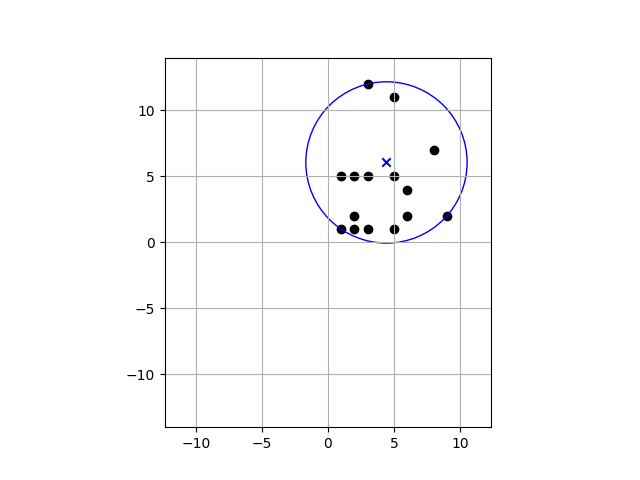

Find the smallest circle around a cluster of points in 2D

By default, a random number of random points are generated with each call of the script (25 to 60 points, x and y in range -15.0 to +15.0). The circle is defined with a center point (consisting of a X and a Y coordinate) and a radius, which are printed as outputs when you execute 'start.py'. All points are within this circle, and the radius of this circle is as small as possible.

The output results are plotted on a 2D plane, with all points and the computed circle. Example points are available in 'TestData.csv' and can be used for testing the implementation through a command line option.

Sample output for stub data using external implementation:  

Environment:
It is assumed that python (version>=3.6.9), pip (version>=20.2.3) and virtualenv (version>=15.1.0) are installed  
Linux:  
$ virtualenv circleEnv -p python3  
$ source circleEnv/bin/activate  
$ pip install matplotlib  
on Linux, tested with matplotlib==3.3.2 

Windows:  
make sure that python3 is installed, check using $ python3 --version  
$ virtualenv circleEnv -p python3  
$ source circleEnv\Scripts\activate.bat  
$ pip install matplotlib  
on Windows10, tested with matplotlib==2.2.5

Usage:  
$ python start.py --useStubData <true/false> --useExternalImpl <true/false>  
if --useStubData true is specified, circle is fitted to points specified in 'TestData.csv', else, random points are generated as described above, and the smallest circle is fitted to the same  

if --useExternalImpl true is specified, an algorithm from a freely available third party source is used for fitting the smallest circle, else, a naive almost-correct custom implementation is used
